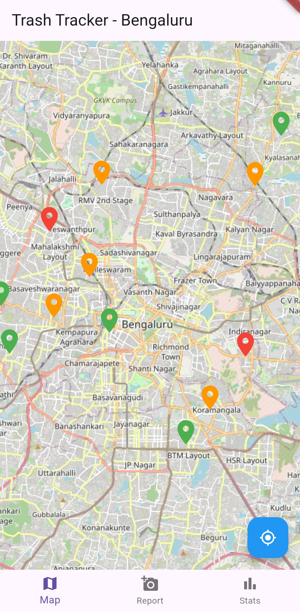
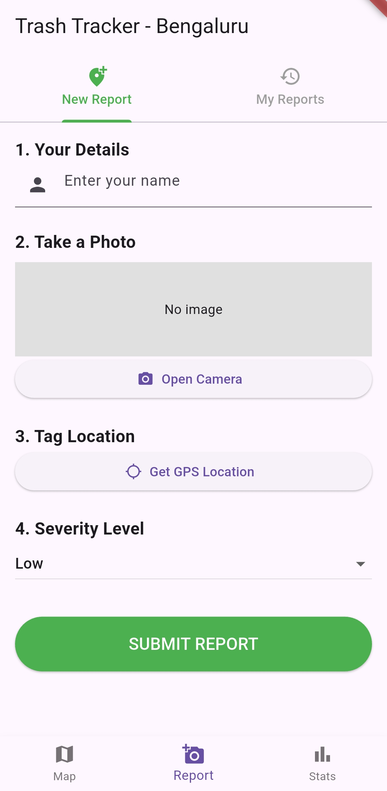
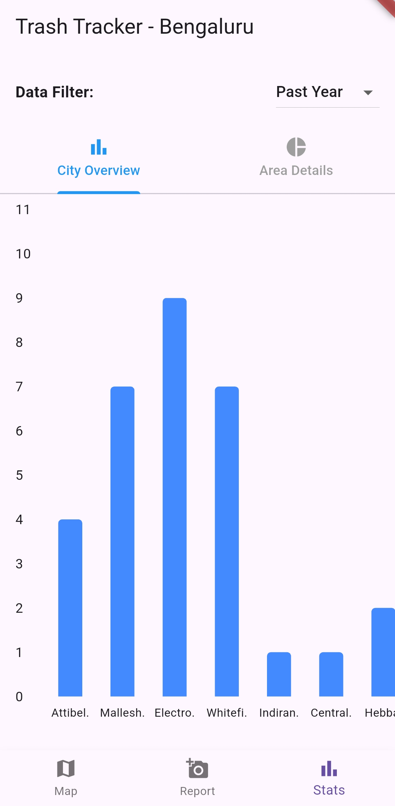
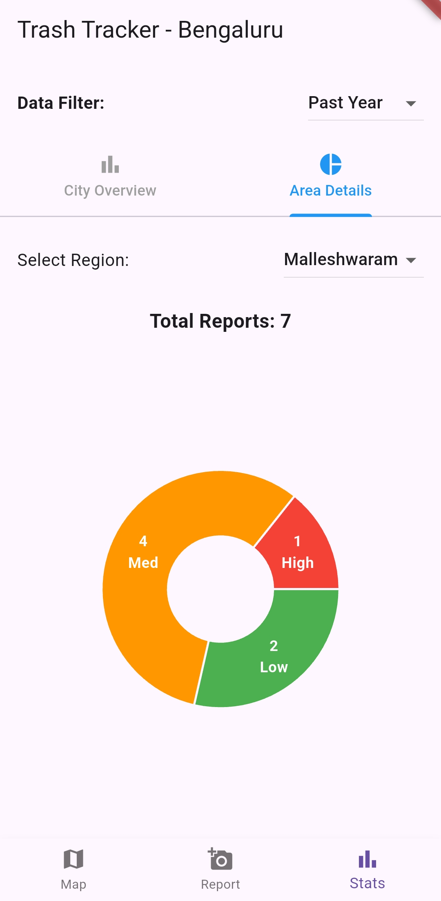

# Bengaluru Trash Tracker 

## About
A prototype Flutter app built to crowd-source and map garbage around Bengaluru. I built this as part of a university project where the focus was on building an application to improve life in an urban setting. 

> Note: This is a proof-of-concept prototype created as part of a university project. It uses in-memory state management is not production-ready as of now. 


The motivation for Trash Tracker came from witnessing the sheer amount of garbage generated around Bengaluru city. The trash generated around my locality in particular had increased steadily over the last two months before the creation of this project. There were no signs of any remedial solutions being taken. Channels to report such issues do exist on paper, but the process can often be convoluted and time-consuming for the average city-dweller. The other alternative is to post on social media, but this only solves a small part of the problem even if the authorities were to respond to a specific post. 

I felt that an app interface would make it easy for someone to report an issue, solving the problem of the convoluted process, and some lasting data in the form of stats that can be visualized would really show the severity of the problem. This would hold the authorities accountable and also hopefully making citizens feel that they should not contribute to the problem. 


---

## How it works

* **Report:** Take a photo of a garbage dump, pick a severity (Low/Med/High), and the app grabs your exact GPS coordinates. It automatically calculates your coordinates and snaps the report to the nearest major neighborhood (Koramangala, Indiranagar, etc.).
* **Statistics:** View statistics of garbage reports submitted by users, both as a City overview and a breakdown of the Neighbourhood.
* **Manage Reports:** Keep track of what you've submitted and delete the report once the issue is actually resolved.
* **Interactive Map:** A scrollable map where reports by other users can be seen, with different colours indicating different severities of garbage. Users can interact with an upvote/downvote system so that other users can judge the reliability of the report.

---

## Screenshots

|||||
|:---:|:---:|:---:|:---:|
| **Map Screen** | **Submit a Report** | **City Overview** | **Area Breakdown** |

---

## Tech Stack

The app is completely developed in [Flutter](https://flutter.dev/). It uses the following packages:
* **State Management:** [provider](https://pub.dev/packages/provider)
* **Maps:** [flutter_map](https://pub.dev/packages/flutter_map) (OpenStreetMap)
* **Location Services**: [geolocator](https://pub.dev/packages/geolocator)
* **Charts:** [fl_chart](https://pub.dev/packages/fl_chart)

---

## Test the app!
Download the [Android APK (v0.1.0)](https://github.com/arnavish/blr-trash-tracker/releases) from the releases section.

### Or, run it locally:
1. Clone the repo:
   ```bash
   git clone https://github.com/arnavish/blr_trash_tracker.git
   ```
2. Get the packages:
   ```bash
   cd blr_trash_tracker
   flutter pub get
   ```
3. Run it (make sure you have an emulator open or an Android phone plugged in with USB debugging enabled):
   ```bash
   flutter run
   ```


*Note: Since this is a prototype, provider is used to store data in-memory. The data resets when you fully restart the app.*

---

## Known Limitations and Future Plans

The project currently focuses on frontend UI, state management, and mapping logic. Several features need to be implemented to make this a production-ready app:

* **No Persistent Backend:** Currently, state is managed in-memory using the `provider` package. If the app is closed, all reports reset. The plan is to integrate a backend like Firebase, Supabase, or PostgreSQL to persist data globally and actually store the uploaded images and reports.
* **Basic Map Visualizations:** The map shows individual pins which can get cluttered in highly affected areas. I wanted to implement a heatmap to highlight affected areas based on the frequency and density of reports.
* **Authenticity of Reports:** The reports rely on an honor system. There is no way to actually verify that an entry is valid, and with the current state of the app, invalid entries can be spammed. The upvote system is meant to be one way of maintaining authenticity, but there needs to be a better way to implement this. One way to reduce spam is to have authentication via OTPs, but I do want to avoid personal data collection when possible. This will have to be further ruminated upon.
* **Neighbourhood limits:** In the current state of the app, the neighbourhood limits are not defined accurately for every single area. There needs to be a proper definition for what areas need to be covered. If this idea is to be developed further, this needs to be improved. 
* **iOS Support:** The code is cross-platform, but has only been tested for Android as of now. The code needs to be compiled on a Mac to release a build for iOS.

Some other future plans are:
* **Involve the Authorities:** The app is currently citizen-facing only. The plan is to include a way for the BBMP and Municipal authorities to interact with reports and mark them as resolved, rather than just the option that exists now of users removing their reports once the problem is resolved.
* **Social Feed:** Reports are currently only visible via map markers. A chronological "Community Feed" tab showing the latest reports from users which can be filtered per area as well. This will tie naturally into the upvoting system and can introduce comments and various other means of interaction. This will also feel familiar to users of other social media apps.


---

## License & Credits

This project is open-source under the [MIT License](LICENSE).

* Map data by [OpenStreetMap](https://www.openstreetmap.org/copyright) (ODbL).
* **AI Disclosure:** I used LLMs when building this to debug Flutter errors, figure out the math for the coordinate-snapping, and write some of the boilerplate UI code. All code was reviewed and tweaked by me to fit the project.
